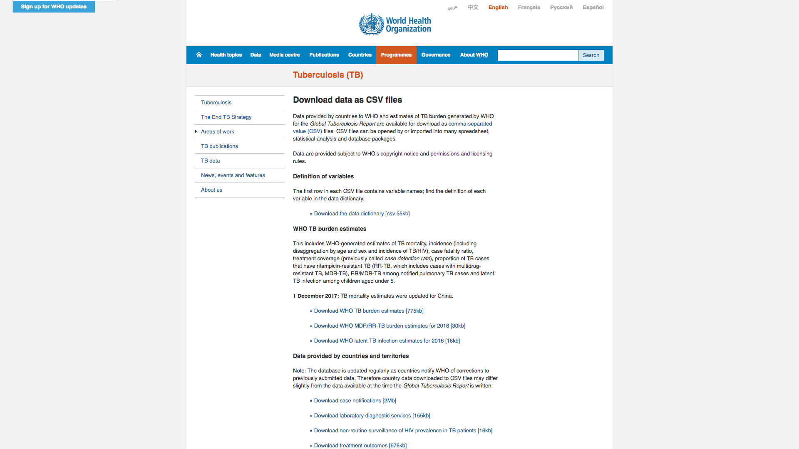
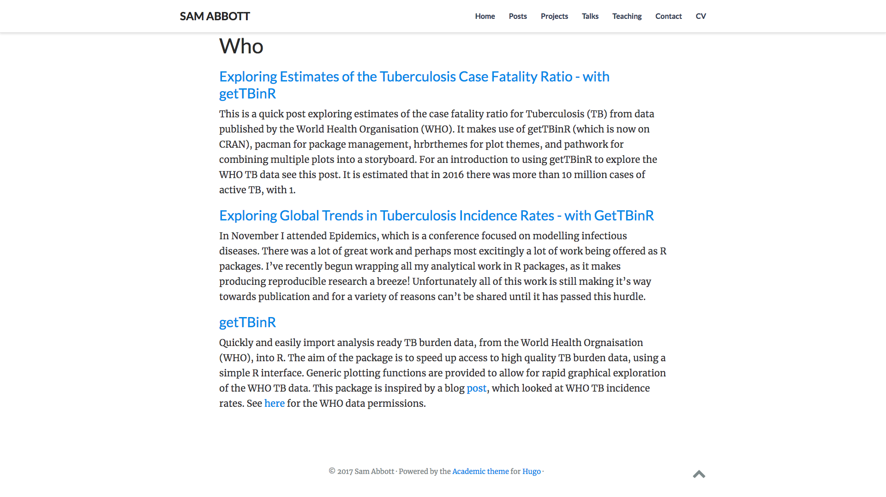
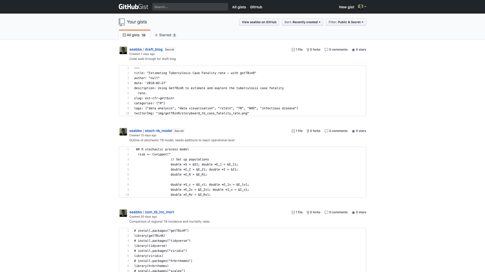

```{r setup, include=FALSE}
options(htmltools.dir.version = FALSE)
```

# Aims

1. Introduce [getTBinR](https://www.samabbott.co.uk/getTBinR/)

1. Explore package functionality

1. Look at package structure

1. Outreach

1. Planned functionality

1. Wrap up and analysis ideas

---
class: center, middle, inverse

# Background

---

# Motivation

- Attended Epidemics at which there were many great R packages being presented, this made me very jealous!

- All my analytical work is wrapped in R packages so this gave me the tools I needed to quickly make a package.

- Working on the WHO TB data for several projects I found myself constantly downloading it and cleaning it.

- Started developing some tools to make this process quicker, along the way I realised more people might find the package useful.

- getTBinR is born!

---

# World Health Organisation TB data

The WHO provide multiple cleaned datasets via their website. They also have a backend API through which other datasets can be accessed, although these tend to be far from tidy. All analysis ready datasets come with a complete data dictionary.

```{r who-data, fig.height = 3, echo = FALSE}

```

---
class: center, middle, inverse

# Set-up

---
# Install the package

CRAN version:

```{r install-getTBinR, eval = FALSE}
install.packages("getTBinR")
```

Alternatively install the GitHub development version:

```{r install-dev-getTBinR, eval = FALSE}
install.packages("devtools")
devtools::install_github("seabbs/getTBinR")
```

---

# Packages for this presentation

This presentation makes use of the [tidyverse](https://www.tidyverse.org/), and [knitr](https://yihui.name/knitr/). It was built using [xaringan](https://github.com/yihui/xaringan).

```{r packages, message = FALSE}
library(getTBinR)
#install.packages("tidyverse")
library(tidyverse)
#install.packages("knitr")
library(knitr)
```

---

# Getting the WHO TB burden data

Get the WHO TB burden data.
```{r get-tb-data}
tb_burden <- getTBinR::get_tb_burden()
```

Inspect the dimensions.
```{r dim-tb}
dim(tb_burden)
```

---

# Getting the WHO TB burden data

Inspect variables.

```{r var-tb, tidy = TRUE}
names(tb_burden)
```

---

# Getting the WHO TB data dictionary

Get the WHO TB data dictionary.

```{r get-dict}
tb_dict <- getTBinR::get_data_dict()
```

Inspect the dimensions.
```{r dim-dict}
dim(tb_dict)
```

Inspect variables.
```{r var-dict}
names(tb_dict)
```

---
class: center, middle, inverse

# Exploring getTBinR functionality

---

# Search for a variable

```{r search-dict}
vars_of_interest <- getTBinR::search_data_dict(var = c("e_inc_100k"),
                                               def = "incidence")
```

---

# Search Result

```{r table-search}
kable(vars_of_interest, "html")
```

---

# Map Global Incidence Rates

```{r map-global-inc, fig.height = 4, dev = 'svg'}
getTBinR::map_tb_burden(metric = "e_inc_100k", verbose = FALSE, interactive = FALSE)
```

---

# Get 10 countries with highest incidence rates in 2016

```{r get-high-inc-countries}
high_inc_countries <- tb_burden %>% 
  filter(year == 2016) %>% 
  group_by(country) %>% 
  summarise(e_inc_100k = max(e_inc_100k)) %>% 
  ungroup %>% 
  arrange(desc(e_inc_100k)) %>% 
  slice(1:10) %>% 
  pull(country) %>% 
  unique
```

---

# 10 countries with highest incidence rates in 2016

```{r high-inc-countries}
high_inc_countries
```

---

# Overview of TB incidence rates

For the countries with the 10 highest incidence rates

```{r plot-tb-inc-overview, fig.height = 4, dev = 'svg'}
getTBinR::plot_tb_burden_overview(metric = "e_inc_100k", countries = high_inc_countries,
                                  verbose = FALSE)
```
---

# Trends over time in TB incidence rates

For the countries with the 10 highest incidence rates

```{r plot-inc--by-country, fig.height = 3, dev = 'svg'}
plot_tb_burden(metric = "e_inc_100k",  
               countries = high_inc_countries,
               facet = "country", scales = "free_y",
               verbose = FALSE)

```

---

# For non R users

getTBinR has a built in `shiny` dashboard which can be run locally using `getTBinR::run_tb_dashboard()`. Alternatively there is a [hosted version](http://www.seabbs.co.uk/shiny/ExploreGlobalTB/). 

```{r dashboard-img, echo = FALSE}
knitr::include_graphics("img/ExploreGlobalTB.png")
```
---
class: center, middle, inverse

# Package Structure

---

# Documentation

Documentation is built using `roxygen`, this is then used to generate a package website using `pkgdown`. See [here](https://github.com/seabbs/getTBinR/blob/master/_pkgdown.yml) for the yaml and [here](https://www.samabbott.co.uk/getTBinR/index.html) for the site.

```{r doc-img, echo = FALSE}
knitr::include_graphics("img/pkgdown_site.png")
```

---

# Testing

- Unit tests are implemented using the `testthat` package. 

- The package is then tested on Linux and Mac using [Travis](https://travis-ci.com/), and on Windows using [AppVeyor](https://ci.appveyor.com/login). See [here](https://github.com/seabbs/getTBinR/tree/master/tests/testthat) for tests, [here](https://github.com/seabbs/getTBinR/blob/master/.travis.yml) for travis set-up , and [here] for [here](https://github.com/seabbs/getTBinR/blob/master/appveyor.yml) Appveyor set-up.

- Code coverage is then checked using [Codecov](https://codecov.io/github/seabbs/getTBinR?branch=master). 

Example test:

```{r example-test, eval = FALSE}
test_that("TB burden data is the same when downloaded using utils::read.csv", {
  tb_data_utils <- get_tb_burden(download_data = TRUE,
                                 use_utils = TRUE,
                                 burden_save_name = "TB_with_utils")
  
  skip_on_cran()
  expect_equal(tb_data, tb_data_utils)
})
```

---
class: center, middle, inverse

# Outreach

---

# Blog posts

I have written several blog posts which have then be editted into vignettes, see [here](https://www.samabbott.co.uk/tags/who/)

```{r blog-img, echo = FALSE}

```

---

# Gists and Tweets

Gists [here](https://gist.github.com/seabbs) and twitter [here](https://twitter.com/seabbs).

```{r gists-img, echo = FALSE}

```

---
class: center, middle, inverse

# Planned Funtionality

---

# Issues

Currently planned functionality has been outlined in the GitHub issues, found [here](https://github.com/seabbs/getTBinR/issues).

```{r issues-img, echo = FALSE}
knitr::include_graphics("img/issues.png")
```

---
class: center, middle, inverse

# Wrap up

---

# Wrap up


Hopefully you enjoyed your whistle stop tour of `getTBinR` and R package construction. I'm interested in your ideas of what can be done with this data. An example;

- Multilevel model to explore country level contributions to incidence rates.
---